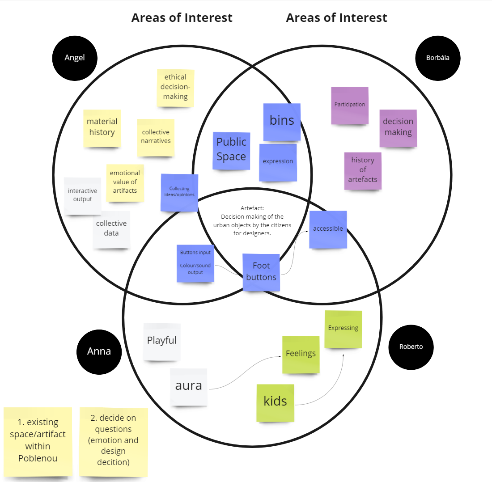
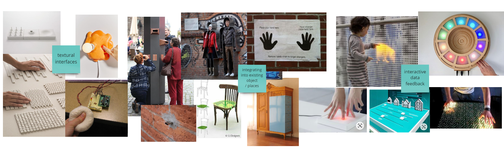
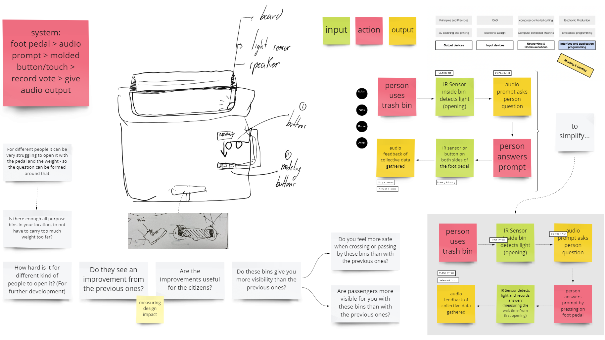
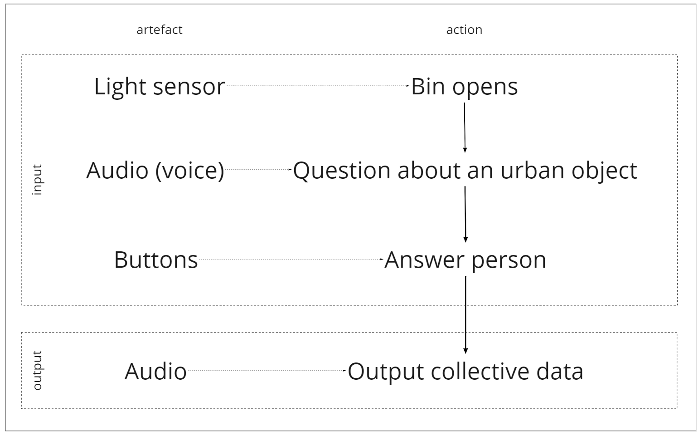
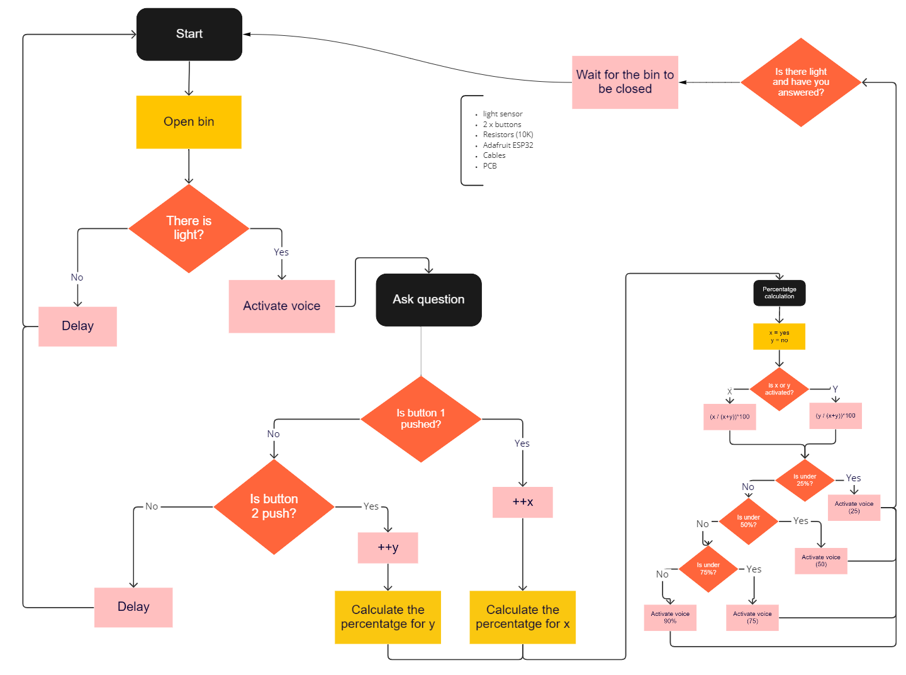
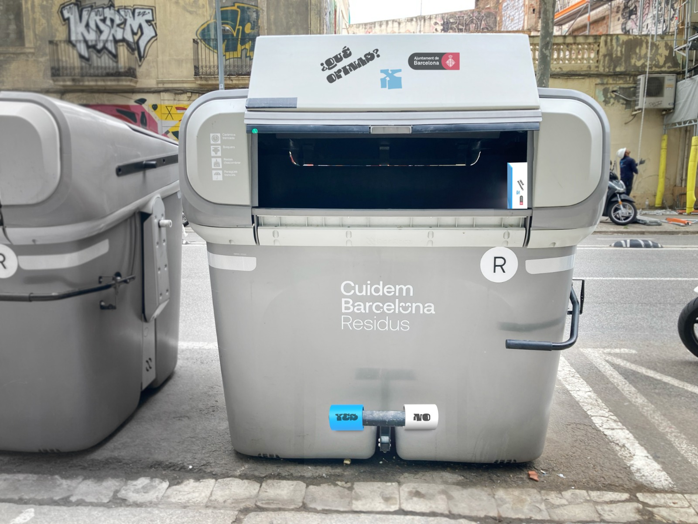

# Fab Academy Challenge III

#### By [Borbala Moravcsik](https://borbalamoravcsik.github.io/mdef-borka/Fabacademy-challenge3.html), [Anna Mestres](https://anna-mestres.github.io/anna.mestres/fab/c3.html), [Angel Cho](https://angel-cho.github.io/mdef22//index.html) & [Roberto Broce](https://roberto-broce.github.io/MDEF-website/index.html)

>Goal:
Tool for collectively reflecting on the effectiveness or meaningfulness of urban (public) design bins by the citizens of the community.

## Areas of Interest

Public design is supposed to be democratic but they often don't consider the community designed they are designing for. For example, these new garbage bins. How does the public actually feel about them, are they "good" or effective designs?

## Briefing

**The theory behind the bins:**

\_Article: [Nuevos contenedores, menos ruido... así es la recogida de residuos que Barcelona empieza a implantar este lunes](https://www.20minutos.es/noticia/4966626/0/nuevos-contenedores-menos-ruido-asi-es-recogida-residuos-barcelona-empieza-implantar-este-lunes/)\_
* First, new lower containers will be progressively incorporated to improve the visibility of pedestrians and, with it, their safety. In addition, they will have different sizes to better adapt to the needs of each neighborhood and the mouths will be calibrated to the corresponding residue.

\_Article: [Barcelona estrena nuevos contenedores y más camiones de basura eléctricos](https://www.elperiodico.com/es/barcelona/20220219/barcelona-estrena-nuevos-contenedores-camiones-13261294)\_
* As of March 7, this new system will be implemented in the first five districts: Ciutat Vella, Eixample, Gràcia, Sant Andreu and Sant Martí. Deployment will be carried out gradually over the following weeks incorporating the new staff and all vehicles and services. From the month of September, implementation will be made in the rest of the city, in the districts of Sants-Montjuïc, Les Corts, Sarrià-Sant Gervasi, Horta-Guinardó and Nou Barris.

## Interaction

### Ethical design

In order to address the ethical design of our artefact we have identified two main themes.

* Understanding of how people feel about and use public design.

* Collective collection and feedback of data.

In the first case, we know that urban designs are studied and tested directly with the city. But interaction in terms of questions and answers is not as widely used. So not only to collect information from each other, but also to make society aware of public opinion, as we see in the second case. In this way, we can design and generate a city for all.

### Protocols

# Design Process

## Ideation & Design Decisions

We knew we wanted to work with an object or architecture that exists in the public design space that everyone uses or interacts with on a daily basis. We were interested in gathering and reflecting on the impacts of design from the perspective of the public community. To find the subject, we went out on a walk outside the IAAC and not long after discovered we were standing around and having a discussion about the new trash bins that have been placed on the streets of Poblenou in the past few weeks. Some of us were confused because we didn't know what the main change was from the old model or if it was any better. We returned to IAAC and started researching on the design and intent of these new bins.

After brainstorming about the main concept, we decided to create a voting device that would collect (and reflect) the opinions of the community, basically anyone who will come to dispose of their trash. We chose a question that is general enough and would reflect the community's feelings, and at the same time provide the feedback back to the community.

In terms of functionality, we discussed what would be the best way for people to cast their votes. Since the garbage bin is typically seen as an unsanitary place, we knew people would not want to touch the bin, so we decided to eliminate the option of capacitive sensors. We explored using infrared sensors that would be attached to the outside of the bin and detect the movement or position of the person., but after the first review with the tutors, we decided to use an interaction which was more intuitive to actually using the garbage bin and and not another separate action.

From this insight, we decided that the act of trowing away the garbage (pushing down on the foot pedal) would trigger the questions, which would be audio. We chose the output to be audio because we didn't want to attach a screen or led sensors to the garbage bin and wanted the interaface to be more "hidden" and less intrusive. As for the voting mechanism, we also decided to put this on the pedal of the bin. But instead of using IR sensors, we chose to go with buttons, because it would provide a more accurate result. Since the pedal is a cylindrical shape with two sides, we decided to fix a button on each side, assigning the 1 and 0 (yes and no). Again, to simplify, we chose the feedback output to stay with audio.

We started mapping the materials and machines we needed to execute our plan in two and half days.

## Materials and Digital Fabrication

The materials that we choose to use for create the "" are:
  * Electronics:
    *  Raspberry Pi 3
    *  2 x Resistors 10k
    *  Phototransistor_Visible_PT15-21C-TR8
    *  Potentiometer_TT_Model-23_4.5x5.0x3.0mm
    *  6 Cables (2800mm x cable)
    *  2 buttons
    *  Supplier Power 5V
  * MDF (770 x 800 x 9.3 mm)
  * Filament
  * Tape doblesided

The Digital Fabrication that we use are:

  * Laser cut (Trotec Speedy 400)
  * Rhino (Rhino 5 is the version to keep the files for make work the laser machine in this case and Rhino 6 to keep the files in CNC)
  * Illustrator (Inskcape it's open resource it could be used too)
  * Welders
  * Phyton
  * 3D Printing Machine

## Flowchart

Anna developed the flow chart in two parts. In the first part, we are asking  got more complex because it had to consider four outputs (audio) based on an average of collected data (yes or no inputs). We later corrected this flow char to...

## Electronics

We mapped out a few different scenarios with the electronics. In the first scenario we would need an ESP board, a midi board (for the sound), and speakers. But if we used a Raspberry Pi instead, we could eliminate the need for the midi board, which we didn't have access to. ...

## Coding

We received a lot of help from Pietro in coding with Python. (Anna reflections?) There were mant iterations and tests, and in order to keep track of what we have tried, we kept all of the past code as comments instead of getting rid of them.  ...

~~~
import RPi.GPIO as GPIO
import time
import pygame
from datetime import datetime
from enum import Enum

GPIO.setmode(GPIO.BCM)
GPIO.setup(4, GPIO.IN)
GPIO.setup(17, GPIO.IN)
GPIO.setup(27, GPIO.IN)

x = 0
y = 0
pygame.mixer.init()

# Possible states:
# lid_close
# playing_question
# waiting_answer
# playing_result
# idle

state = "lid_closed"
idle_timer = 0
waiting_answer_timer = 0

def ask_question_one():
    global x
    x = x + 1
    result = round((x / (x+y))*100, 0)
    play_result_audio(result)
    print(result,f"% of yes -- X is {x} and Y is {y}")
    with open('output.txt', 'a') as f:
        f.write(f"{datetime.now().strftime('%d/%m/%Y - %H:%M:%S')} The user pressed Yes {x} times. Result is {result} \r\n")

def ask_question_two():
    global y
    y = y + 1
    result = round((y / (x+y))*100, 0)
    play_result_audio(result)
    print(result, f"% of no -- X is {x} and Y is {y}")
    with open('output.txt', 'a') as f:    
        f.write(f"{datetime.now().strftime('%d/%m/%Y - %H:%M:%S')} The user pressed No {y} times. Result is {result} \r\n")

def play_result_audio(result):
    if result < 25:
        #playsound('Bin02.mp3')
        pygame.mixer.music.load("Bin02.mp3")
        pygame.mixer.music.play(loops=1)
        while pygame.mixer.music.get_busy() == True:
            continue
        print(f"play sound < 25 {result}")
    elif result < 50:
        #playsound('Bin03.mp3')
        pygame.mixer.music.load("Bin03.mp3")
        pygame.mixer.music.play(loops=1)
        while pygame.mixer.music.get_busy() == True:
            continue
        print(f"play sound < 50 {result}")
    elif result < 75:
        #playsound('Bin04.mp3')
        pygame.mixer.music.load("Bin04.mp3")
        pygame.mixer.music.play(loops=1)
        while pygame.mixer.music.get_busy() == True:
            continue
        print(f"play sound < 75 {result}")
    else:
        #playsound('Bin05.mp3')
        pygame.mixer.music.load("Bin05.mp3")
        pygame.mixer.music.play(loops=1)
        while pygame.mixer.music.get_busy() == True:
            continue
        print(f"play sound < 100 {result}")

with open('output.txt', 'a') as f:
    f.write(f"Beginning of reading {datetime.now().strftime('%d/%m/%Y - %H:%M:%S')} \r\n")

while True:
    if state == "lid_closed":
        print("[STATE] Lid is closed")
        if GPIO.input(4) == 0:
            state = "playing_question"
        time.sleep(0.5)

    elif state == "playing_question":
        print("[STATE] Playing question")
        pygame.mixer.music.load("Bin01.mp3")
        pygame.mixer.music.play(loops=1)
        while pygame.mixer.music.get_busy() == True:
            continue
        waiting_answer_timer = time.time()
        state = "waiting_answer"

    elif state == "waiting_answer":
        print("[STATE] Waiting for an waiting_answer")
        if GPIO.input(17) == 0:
            print("Yes")
            ask_question_one()
            idle_timer = time.time()
            state = "idle"

        elif GPIO.input(27) == 0:
            print("No")  
            ask_question_two()
            idle_timer = time.time()
            state = "idle"
        if time.time() > waiting_answer_timer + 20:
            state = "idle"

    elif state == "idle":
        print("[STATE] Idle")
        if time.time() > idle_timer + 20:
            if GPIO.input(4) == 0:
                idle_timer = time.time()

    if GPIO.input(4) == 1 and state != "waiting_answer" and state != "playing_result":
        print("[STATE] Lid was closed")
        state = "lid_closed"
~~~

## Structural Design

## Content

## Prototyping

## Testing

## Key Learnings
